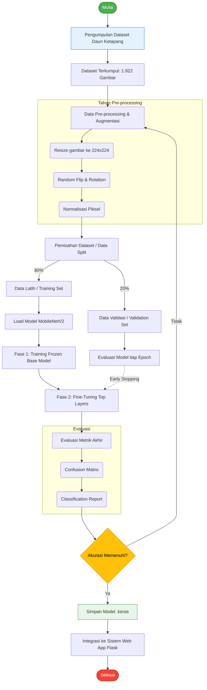

# Alur Kerja Penelitian (Flowchart Metodologi)

Bos, ini adalah alur kerja sistem dari awal sampai akhir. Kamu bisa salin kode di bawah ini ke *Mermaid Live Editor* (https://mermaid.live/) untuk otomatis diubah jadi gambar yang bisa di-paste ke Word (Bab 3), atau tunjukkin aja alur ini ke dosennya kalau ditanya.

### Penjelasan Flowchart (Bisa dicopas ke Bab 3)
1. **Pengumpulan Dataset:** Gambar daun ketapang (muda, menguning, tua) dikumpulkan dengan total 1.922 data citra.
2. **Pre-processing:** Gambar diubah ukurannya menjadi 224x224 piksel menyesuaikan format *input* standar MobileNetV2, dan dilakukan augmentasi (rotasi/flip) untuk memperkaya variasi data.
3. **Pemisahan Dataset:** Dataset dibagi secara dinamis menggunakan rasio 80% data latih dan 20% data validasi.
4. **Pemodelan (MobileNetV2):** Model dilatih dalam 2 tahap. Tahap pertama membekukan (*freeze*) bobot asli ImageNet, tahap kedua melakukan *fine-tuning* pada layer atas agar model lebih sensitif terhadap pola tekstur daun.
5. **Evaluasi & Iterasi:** Model divalidasi dan diuji tingkat *error*-nya. Jika akurasi belum maksimal, model diulang, namun jika sudah stabil (memenuhi Early Stopping), model langsung disimpan.
6. **Integrasi Sistem:** Model `.keras` yang telah jadi, dihubungkan ke antarmuka pengguna berbasis Web menggunakan *framework* Flask.
